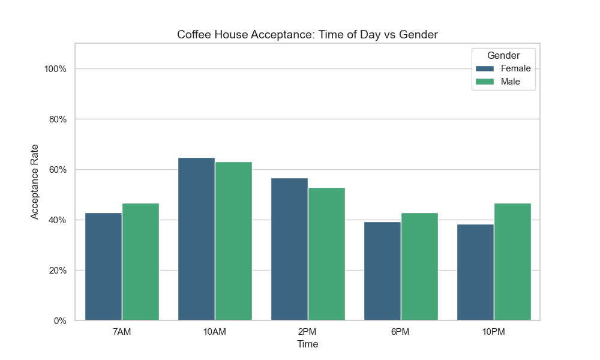
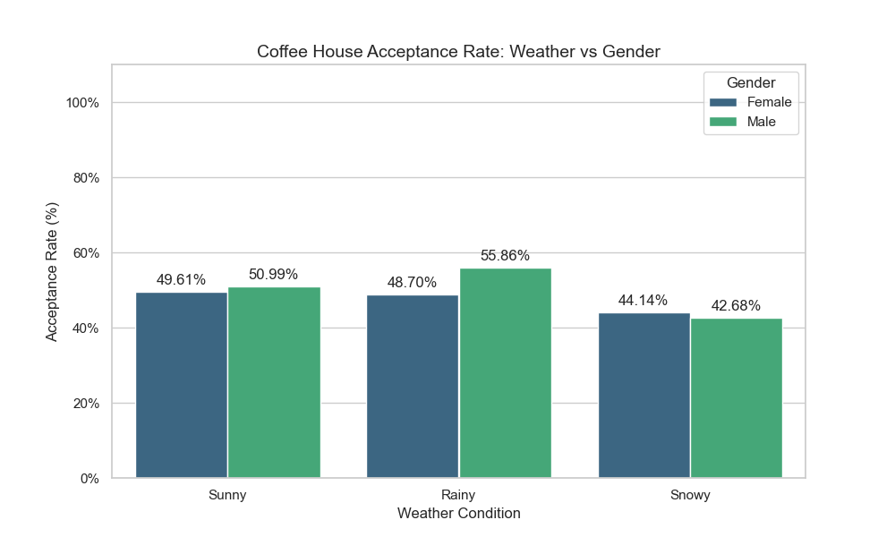
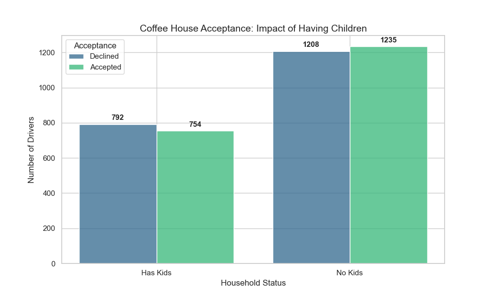
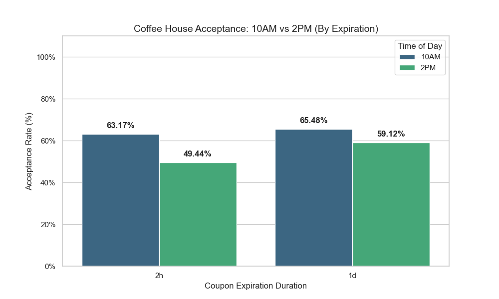
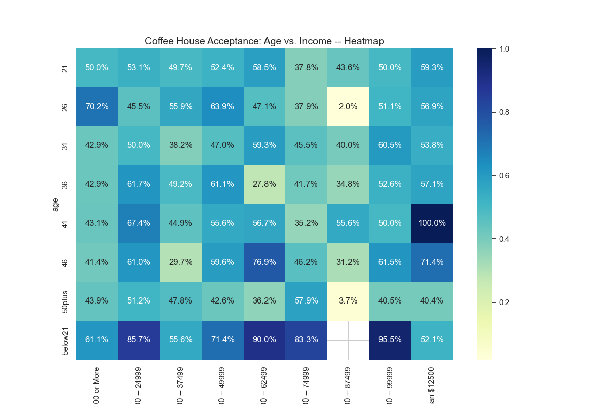
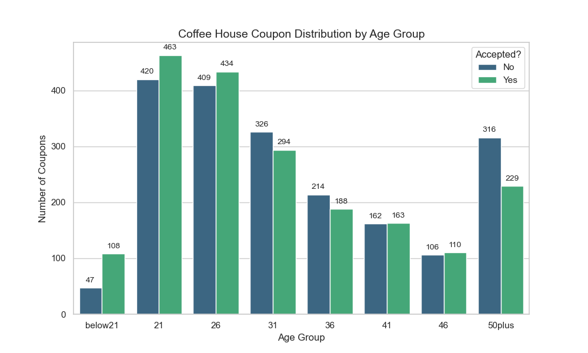
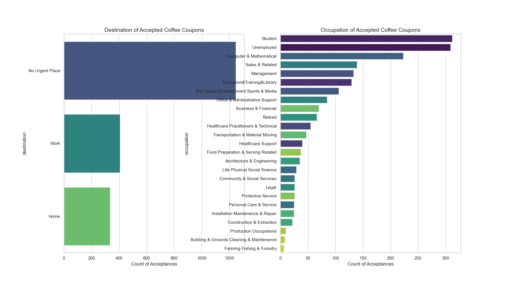

# MODULE_5

## Project: Will Customer Accept the Cupon?

### Executive Summary
This project analyzes a dataset containing survey responses regarding whether a driver would accept various coupons (i.e. Bars, Coffee Houses, Carry Away, Cheap Restaurants and Expensive Restaurants) based on their current context (i.e. destination, passanger, weather, temperature, time, gender, age and expiration). The plots of choice for this analysis are based on the fact survey data is almost all categorical (i.e. text labels like "Sunny", "10AM", "Student"), therefore, scatter plots or histrograms would not have been very useful.

### Key Findings on "Coffee House" Coupons

### The optimum time window for Coffee
This analysis shows that coffee coupon acceptance peaks during **10AM and 2PM**. 
This suggests drivers view coffee as a mid-morning break or an afternoon "boost"

### Environmental & Social Factors
* **Weather:** Acceptance rates are significantly higher on **Rainy** days followed by Sunny or Snowy conditions
* **"Kids" factor:** Drivers with no children in the car are more likely to accept coffee coupons, probably because convenience while making the extra stop with passengers
* **Expiration:** Coupons with a **1 day expiration** slightly outperformed the 2 hr wondow coupons, indicating drivers value flexibility

### Demographic Insights
* **Age vs Income:** Using a heatmap analysis, we identified that **younger drivers (21 - 26)** across various income levels are the most frequent adopters of Coffee House coupons
* **Gender:** The distribution of Male and Female adopters of Coffee House coupons is very even with Males displaying slightly higher uptick on rainy days (i.e. ~5% higher)
* **Destination and Occupation:** The highest acceptance rate for Coffee House coupons comes from people who have “No Urgent Place” to go and either Students or Unemployed people 

### Visualizations

*Figure 1: Optimum time window for Coffee*


*Figure 2: Weather Acceptance Rate*


*Figure 3: Driving with Kids in the Car*


*Figure 4: Coupon Expiration*


*Figure 5: Age vs Income*


*Figure 6: Acceptance Rate by Age*


*Figure 6: Subplot: Destination and Occupation*

### Recommendations and Next Steps
1. Each coupon code requires it's own analysis
2. It will be interesting to further explore if there are other factors besides income and occupation motivating people to select cheaper restaurants vs expensive restaurants
3. The "Greater than or Equal to" categories need further exploration
4. Transformation of some data from categorical string to a nunmber in order to enable analysis with other type of plots like Scatter, Histograms or Box Plots might be useful but requires further exploration

### Repository Structure
```text
├── data/                      # Folder containing the coupon survey raw data for this analysis
│   ├── coupons.csv
├── images/                    # Folder containing all generated plots
│   ├── barplot1.png
│   ├── barplot2.png
│   ├── barplot3.png
│   ├── barplot4.png
│   ├── barplot5.png
│   ├── barplot6.png
│   ├── barplot7.png
│   ├── barplot8.png
│   ├── countplot1.png
│   └── heatplot1.png
│   └── histo1.png
│   └── histo2.png
│   └── subplot1.png
├── prompt.ipynb               # Main Jupyter Notebook with Python code
└── README.md                  # Project report and documentation (this file)
